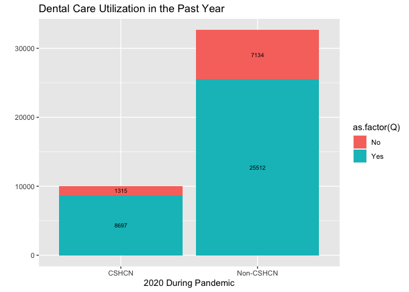
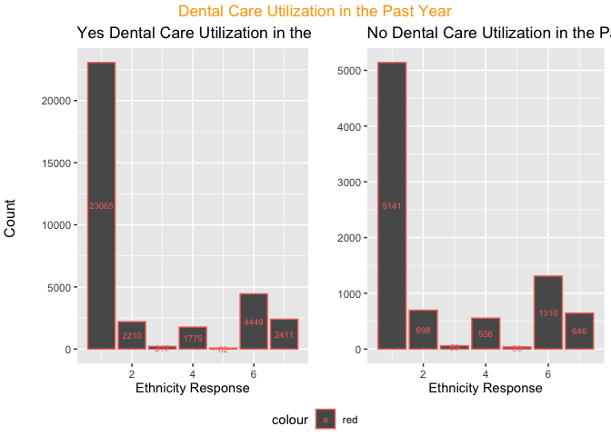
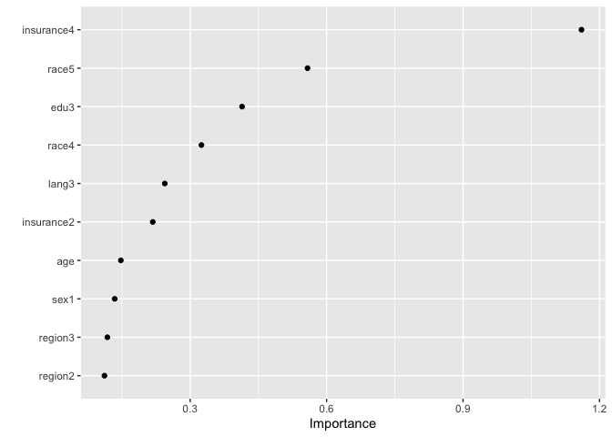
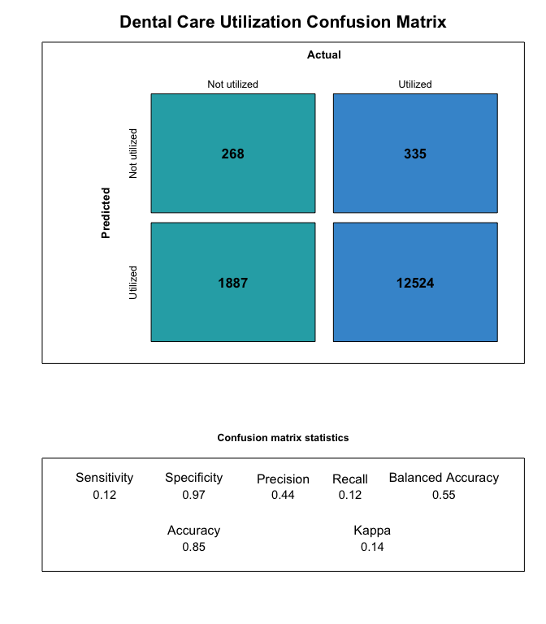
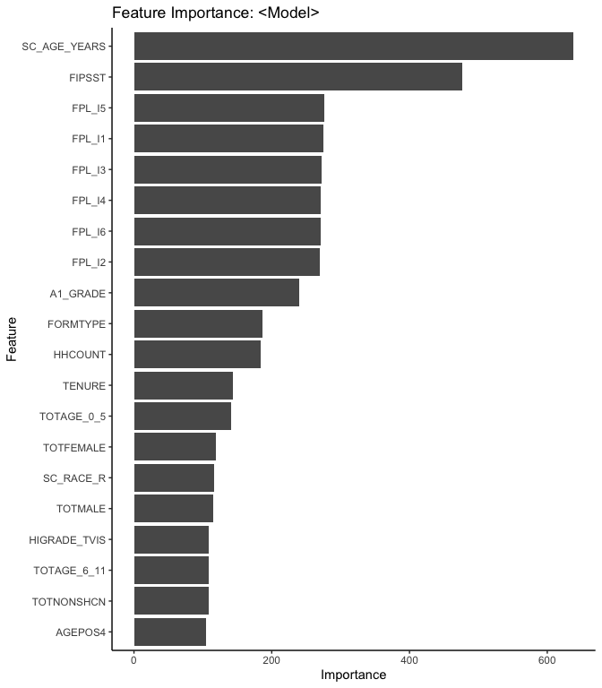
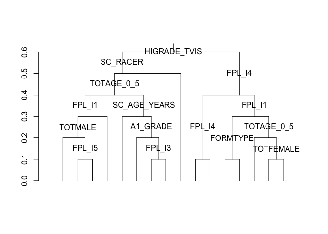

Predicting Dental Care Utilization (260 Final Project)
================
Devika Godbole
2022-12-14

``` r
knitr::opts_chunk$set(echo = FALSE)
```

## Introduction

One in every five children experience special healthcare needs in the
United States (Williams 2021). Special healthcare needs are defined as
“physical, intellectual, and developmental disabilities, as well as
long-standing medical conditions, such as asthma, diabetes, a blood
disorder, or muscular dystrophy” (CDC 2019).

Previous studies reported that children with special healthcare needs
(CSHCN) experience a higher burden of oral health problems compared to
those who are not CSHCN (Lebrun-Harris 2021). CSHCN are at a higher risk
for dental trauma injuries due to increased fall risk and dental
anomalies such as supernumerary teeth (Devinsky 2020). Medications
prescribed to treat conditions among CSHCN, such as seizure disorders,
lead to oral conditions including xerostomia and gingival hyperplasia
(Devinsky 2020). Sociobehaviorally, CSHCN may be more prone to a
cariogenic diet due to a higher consumption of sugary foods, further
raising the risks of dental caries (Devinsky 2020).

The high caries risk among CSHCN may also be attributed to challenges
with home care, specifically oral hygiene maintenance. For example, a
survey on pre-school aged CSHCN found that four out of five CSHCN
parents reported difficulties with brushing their children’s teeth
(Huebner 2015). Limitations in dental services available to CSHCN is
also a major barrier to consider. In the United States, there is a
national shortage of dentists and healthcare institutions equipped to
provide dental services for CSHCN (Lebrun-Harris 2021). Reasons why
CSHCN families struggle to find dental care include dentists refusing to
accept Medicaid or treat patients who are CSHCN (Kagihara 2011). Within
dental education, the current training for dental professionals in
caring for CSHCN is highly limited–major inconsistencies exist across
dental education institutions in both pre-doctoral and residency
training (Inclan 2019) (Baker 2017).

While dental care utilization among children has been trending upwards
in the past decade in the U.S., the COVID-19 pandemic poses an
additional challenge to oral health access, potentially especially for
CSHCN. We consider two modeling methods to determine important features
for predicting a lack of dental care utilization and assess whether
special health care needs children are particularly affected.

## Methods

The study used 1) a more biostatistical logistic regression utilizing
domain knowledge to select covariates as well as 2) less user defined
random forest using all available features to predict dental care
utilization during the COVID-19 pandemic using data from the 2020
National Survey of Children’s Health (N=41,380). Variables in the source
included children’s demographic background and health information. The
data was split into 80% training and 20% testing set.

The National Survey of Children’s Health (NSCH) is an annual,
cross-sectional survey conducted by the U.S. Census Bureau and funded by
the Health Resources and Services Administration’s Maternal and Child
Health Bureau. This publicly-available survey dataset provided
state-level data on the health and well-being of children aged 0 to 17.
The 2020 survey was administered from June 2020 to January 2021 and is
accordingly considered “during pandemic” for this purposes of this
study. Both children and their households were randomly sampled and
screened. Caregivers of eligible children were surveyed via the phone,
internet, or mail in English or Spanish.

Modeling was completed using R/R Studio Software, version 1.3.1093.
Children aged less than 1 were excluded from the analysis and any
columns with missingness were removed. The total study population after
exclusions was N = 31229 for this data set.

The study implemented two models – a logistic regression and a random
forest model. The logistic regression used glm net with cv set to lambda
min as the regularization method. Both models consisted of “was dental
care utilized during the past 12 months year” as the binary response
variable along with typical sociodemographic covariates (age, sex,
race/ethnicity, federal poverty level, state of residence, region of
residence, health insurance coverage, and primary caregiver’s marital
status, and SHCN). The random forest algorithm had a larger selection of
available features however. Confusion matrices were created for the test
set predictions for each model and the metrics were compared.

## Analysis

We begin with a Table 1 to understand the population.

<table>
<thead>
<tr>
<th style="text-align:left;">
 
</th>
<th style="text-align:left;">
Did Not Utilize
</th>
<th style="text-align:left;">
Utilized
</th>
<th style="text-align:left;">
Overall
</th>
</tr>
</thead>
<tbody>
<tr>
<td style="text-align:left;">
</td>
<td style="text-align:left;">
(N=5786)
</td>
<td style="text-align:left;">
(N=33838)
</td>
<td style="text-align:left;">
(N=39738)
</td>
</tr>
<tr>
<td style="text-align:left;">
Special Health Care Needs Status
</td>
<td style="text-align:left;">
</td>
<td style="text-align:left;">
</td>
<td style="text-align:left;">
</td>
</tr>
<tr>
<td style="text-align:left;">
  No SHCN
</td>
<td style="text-align:left;">
4622 (79.9%)
</td>
<td style="text-align:left;">
25170 (74.4%)
</td>
<td style="text-align:left;">
29874 (75.2%)
</td>
</tr>
<tr>
<td style="text-align:left;">
  Yes SCHN
</td>
<td style="text-align:left;">
1164 (20.1%)
</td>
<td style="text-align:left;">
8668 (25.6%)
</td>
<td style="text-align:left;">
9864 (24.8%)
</td>
</tr>
<tr>
<td style="text-align:left;">
Age (yrs)
</td>
<td style="text-align:left;">
</td>
<td style="text-align:left;">
</td>
<td style="text-align:left;">
</td>
</tr>
<tr>
<td style="text-align:left;">
  Mean (SD)
</td>
<td style="text-align:left;">
7.64 (5.39)
</td>
<td style="text-align:left;">
10.5 (4.49)
</td>
<td style="text-align:left;">
10.1 (4.75)
</td>
</tr>
<tr>
<td style="text-align:left;">
  Median [Min, Max]
</td>
<td style="text-align:left;">
6.00 [2.00, 17.0]
</td>
<td style="text-align:left;">
11.0 [2.00, 17.0]
</td>
<td style="text-align:left;">
11.0 [2.00, 17.0]
</td>
</tr>
<tr>
<td style="text-align:left;">
Federal Poverty Level
</td>
<td style="text-align:left;">
</td>
<td style="text-align:left;">
</td>
<td style="text-align:left;">
</td>
</tr>
<tr>
<td style="text-align:left;">
  Mean (SD)
</td>
<td style="text-align:left;">
242 (129)
</td>
<td style="text-align:left;">
292 (123)
</td>
<td style="text-align:left;">
285 (125)
</td>
</tr>
<tr>
<td style="text-align:left;">
  Median [Min, Max]
</td>
<td style="text-align:left;">
239 [50.0, 400]
</td>
<td style="text-align:left;">
348 [50.0, 400]
</td>
<td style="text-align:left;">
332 [50.0, 400]
</td>
</tr>
<tr>
<td style="text-align:left;">
Sex of Adolescent
</td>
<td style="text-align:left;">
</td>
<td style="text-align:left;">
</td>
<td style="text-align:left;">
</td>
</tr>
<tr>
<td style="text-align:left;">
  Male
</td>
<td style="text-align:left;">
2651 (45.8%)
</td>
<td style="text-align:left;">
16529 (48.8%)
</td>
<td style="text-align:left;">
19226 (48.4%)
</td>
</tr>
<tr>
<td style="text-align:left;">
  Female
</td>
<td style="text-align:left;">
3135 (54.2%)
</td>
<td style="text-align:left;">
17309 (51.2%)
</td>
<td style="text-align:left;">
20512 (51.6%)
</td>
</tr>
<tr>
<td style="text-align:left;">
Insurance Coverage Level
</td>
<td style="text-align:left;">
</td>
<td style="text-align:left;">
</td>
<td style="text-align:left;">
</td>
</tr>
<tr>
<td style="text-align:left;">
  1
</td>
<td style="text-align:left;">
1884 (32.6%)
</td>
<td style="text-align:left;">
7738 (22.9%)
</td>
<td style="text-align:left;">
9645 (24.3%)
</td>
</tr>
<tr>
<td style="text-align:left;">
  2
</td>
<td style="text-align:left;">
2979 (51.5%)
</td>
<td style="text-align:left;">
23570 (69.7%)
</td>
<td style="text-align:left;">
26583 (66.9%)
</td>
</tr>
<tr>
<td style="text-align:left;">
  3
</td>
<td style="text-align:left;">
231 (4.0%)
</td>
<td style="text-align:left;">
1248 (3.7%)
</td>
<td style="text-align:left;">
1480 (3.7%)
</td>
</tr>
<tr>
<td style="text-align:left;">
  4
</td>
<td style="text-align:left;">
649 (11.2%)
</td>
<td style="text-align:left;">
1143 (3.4%)
</td>
<td style="text-align:left;">
1795 (4.5%)
</td>
</tr>
<tr>
<td style="text-align:left;">
  Missing
</td>
<td style="text-align:left;">
43 (0.7%)
</td>
<td style="text-align:left;">
139 (0.4%)
</td>
<td style="text-align:left;">
235 (0.6%)
</td>
</tr>
<tr>
<td style="text-align:left;">
Race/Ethnicity
</td>
<td style="text-align:left;">
</td>
<td style="text-align:left;">
</td>
<td style="text-align:left;">
</td>
</tr>
<tr>
<td style="text-align:left;">
  White Non-Hispanic
</td>
<td style="text-align:left;">
3382 (58.5%)
</td>
<td style="text-align:left;">
22823 (67.4%)
</td>
<td style="text-align:left;">
26255 (66.1%)
</td>
</tr>
<tr>
<td style="text-align:left;">
  Black Non-Hispanic
</td>
<td style="text-align:left;">
530 (9.2%)
</td>
<td style="text-align:left;">
2194 (6.5%)
</td>
<td style="text-align:left;">
2741 (6.9%)
</td>
</tr>
<tr>
<td style="text-align:left;">
  American Indian Alaskan Native Non-Hispanic
</td>
<td style="text-align:left;">
46 (0.8%)
</td>
<td style="text-align:left;">
211 (0.6%)
</td>
<td style="text-align:left;">
258 (0.6%)
</td>
</tr>
<tr>
<td style="text-align:left;">
  Asian Non-Hispanic
</td>
<td style="text-align:left;">
432 (7.5%)
</td>
<td style="text-align:left;">
1760 (5.2%)
</td>
<td style="text-align:left;">
2205 (5.5%)
</td>
</tr>
<tr>
<td style="text-align:left;">
  Native Hawaiian Other Pacific Islander Non-Hispanic
</td>
<td style="text-align:left;">
26 (0.4%)
</td>
<td style="text-align:left;">
81 (0.2%)
</td>
<td style="text-align:left;">
107 (0.3%)
</td>
</tr>
<tr>
<td style="text-align:left;">
  Hispanic
</td>
<td style="text-align:left;">
939 (16.2%)
</td>
<td style="text-align:left;">
4389 (13.0%)
</td>
<td style="text-align:left;">
5357 (13.5%)
</td>
</tr>
<tr>
<td style="text-align:left;">
  Other/Missing
</td>
<td style="text-align:left;">
431 (7.4%)
</td>
<td style="text-align:left;">
2380 (7.0%)
</td>
<td style="text-align:left;">
2815 (7.1%)
</td>
</tr>
<tr>
<td style="text-align:left;">
Primary Caregiver Marital Status
</td>
<td style="text-align:left;">
</td>
<td style="text-align:left;">
</td>
<td style="text-align:left;">
</td>
</tr>
<tr>
<td style="text-align:left;">
  Married/Living with Partner
</td>
<td style="text-align:left;">
4393 (75.9%)
</td>
<td style="text-align:left;">
26928 (79.6%)
</td>
<td style="text-align:left;">
31374 (79.0%)
</td>
</tr>
<tr>
<td style="text-align:left;">
  Single/Never Married
</td>
<td style="text-align:left;">
908 (15.7%)
</td>
<td style="text-align:left;">
4764 (14.1%)
</td>
<td style="text-align:left;">
5684 (14.3%)
</td>
</tr>
<tr>
<td style="text-align:left;">
  Divorced/Widowed/Separated
</td>
<td style="text-align:left;">
243 (4.2%)
</td>
<td style="text-align:left;">
1149 (3.4%)
</td>
<td style="text-align:left;">
1398 (3.5%)
</td>
</tr>
<tr>
<td style="text-align:left;">
  Missing
</td>
<td style="text-align:left;">
242 (4.2%)
</td>
<td style="text-align:left;">
997 (2.9%)
</td>
<td style="text-align:left;">
1282 (3.2%)
</td>
</tr>
<tr>
<td style="text-align:left;">
Region
</td>
<td style="text-align:left;">
</td>
<td style="text-align:left;">
</td>
<td style="text-align:left;">
</td>
</tr>
<tr>
<td style="text-align:left;">
  Northeast
</td>
<td style="text-align:left;">
816 (14.1%)
</td>
<td style="text-align:left;">
4892 (14.5%)
</td>
<td style="text-align:left;">
5728 (14.4%)
</td>
</tr>
<tr>
<td style="text-align:left;">
  Midwest
</td>
<td style="text-align:left;">
717 (12.4%)
</td>
<td style="text-align:left;">
4900 (14.5%)
</td>
<td style="text-align:left;">
5633 (14.2%)
</td>
</tr>
<tr>
<td style="text-align:left;">
  South
</td>
<td style="text-align:left;">
1391 (24.0%)
</td>
<td style="text-align:left;">
7912 (23.4%)
</td>
<td style="text-align:left;">
9322 (23.5%)
</td>
</tr>
<tr>
<td style="text-align:left;">
  West
</td>
<td style="text-align:left;">
1708 (29.5%)
</td>
<td style="text-align:left;">
8817 (26.1%)
</td>
<td style="text-align:left;">
10555 (26.6%)
</td>
</tr>
<tr>
<td style="text-align:left;">
  Missing
</td>
<td style="text-align:left;">
1154 (19.9%)
</td>
<td style="text-align:left;">
7317 (21.6%)
</td>
<td style="text-align:left;">
8500 (21.4%)
</td>
</tr>
<tr>
<td style="text-align:left;">
Primary Language Spoken at Home
</td>
<td style="text-align:left;">
</td>
<td style="text-align:left;">
</td>
<td style="text-align:left;">
</td>
</tr>
<tr>
<td style="text-align:left;">
  English is primary language
</td>
<td style="text-align:left;">
5074 (87.7%)
</td>
<td style="text-align:left;">
31545 (93.2%)
</td>
<td style="text-align:left;">
36712 (92.4%)
</td>
</tr>
<tr>
<td style="text-align:left;">
  Spanish is primary language
</td>
<td style="text-align:left;">
327 (5.7%)
</td>
<td style="text-align:left;">
1146 (3.4%)
</td>
<td style="text-align:left;">
1480 (3.7%)
</td>
</tr>
<tr>
<td style="text-align:left;">
  Another language is primary language
</td>
<td style="text-align:left;">
357 (6.2%)
</td>
<td style="text-align:left;">
1035 (3.1%)
</td>
<td style="text-align:left;">
1402 (3.5%)
</td>
</tr>
<tr>
<td style="text-align:left;">
  Missing
</td>
<td style="text-align:left;">
28 (0.5%)
</td>
<td style="text-align:left;">
112 (0.3%)
</td>
<td style="text-align:left;">
144 (0.4%)
</td>
</tr>
<tr>
<td style="text-align:left;">
Primary Caregiver Employment Level
</td>
<td style="text-align:left;">
</td>
<td style="text-align:left;">
</td>
<td style="text-align:left;">
</td>
</tr>
<tr>
<td style="text-align:left;">
  Not employed
</td>
<td style="text-align:left;">
1490 (25.8%)
</td>
<td style="text-align:left;">
6506 (19.2%)
</td>
<td style="text-align:left;">
8018 (20.2%)
</td>
</tr>
<tr>
<td style="text-align:left;">
  At least 1 parent employed
</td>
<td style="text-align:left;">
4042 (69.9%)
</td>
<td style="text-align:left;">
26263 (77.6%)
</td>
<td style="text-align:left;">
30354 (76.4%)
</td>
</tr>
<tr>
<td style="text-align:left;">
  Missing
</td>
<td style="text-align:left;">
254 (4.4%)
</td>
<td style="text-align:left;">
1069 (3.2%)
</td>
<td style="text-align:left;">
1366 (3.4%)
</td>
</tr>
<tr>
<td style="text-align:left;">
mental
</td>
<td style="text-align:left;">
</td>
<td style="text-align:left;">
</td>
<td style="text-align:left;">
</td>
</tr>
<tr>
<td style="text-align:left;">
  Mean (SD)
</td>
<td style="text-align:left;">
2.13 (0.975)
</td>
<td style="text-align:left;">
2.01 (0.881)
</td>
<td style="text-align:left;">
2.02 (0.896)
</td>
</tr>
<tr>
<td style="text-align:left;">
  Median [Min, Max]
</td>
<td style="text-align:left;">
2.00 [1.00, 5.00]
</td>
<td style="text-align:left;">
2.00 [1.00, 5.00]
</td>
<td style="text-align:left;">
2.00 [1.00, 5.00]
</td>
</tr>
<tr>
<td style="text-align:left;">
  Missing
</td>
<td style="text-align:left;">
237 (4.1%)
</td>
<td style="text-align:left;">
969 (2.9%)
</td>
<td style="text-align:left;">
1249 (3.1%)
</td>
</tr>
<tr>
<td style="text-align:left;">
Primary Caregiver Physical Health Level
</td>
<td style="text-align:left;">
</td>
<td style="text-align:left;">
</td>
<td style="text-align:left;">
</td>
</tr>
<tr>
<td style="text-align:left;">
  Mean (SD)
</td>
<td style="text-align:left;">
2.26 (0.934)
</td>
<td style="text-align:left;">
2.11 (0.873)
</td>
<td style="text-align:left;">
2.14 (0.884)
</td>
</tr>
<tr>
<td style="text-align:left;">
  Median [Min, Max]
</td>
<td style="text-align:left;">
2.00 [1.00, 5.00]
</td>
<td style="text-align:left;">
2.00 [1.00, 5.00]
</td>
<td style="text-align:left;">
2.00 [1.00, 5.00]
</td>
</tr>
<tr>
<td style="text-align:left;">
  Missing
</td>
<td style="text-align:left;">
239 (4.1%)
</td>
<td style="text-align:left;">
976 (2.9%)
</td>
<td style="text-align:left;">
1259 (3.2%)
</td>
</tr>
<tr>
<td style="text-align:left;">
Primary Caregiver Education Level
</td>
<td style="text-align:left;">
</td>
<td style="text-align:left;">
</td>
<td style="text-align:left;">
</td>
</tr>
<tr>
<td style="text-align:left;">
  Less than high school
</td>
<td style="text-align:left;">
297 (5.1%)
</td>
<td style="text-align:left;">
769 (2.3%)
</td>
<td style="text-align:left;">
1074 (2.7%)
</td>
</tr>
<tr>
<td style="text-align:left;">
  High school
</td>
<td style="text-align:left;">
1198 (20.7%)
</td>
<td style="text-align:left;">
4122 (12.2%)
</td>
<td style="text-align:left;">
5342 (13.4%)
</td>
</tr>
<tr>
<td style="text-align:left;">
  More than high school
</td>
<td style="text-align:left;">
4291 (74.2%)
</td>
<td style="text-align:left;">
28947 (85.5%)
</td>
<td style="text-align:left;">
33322 (83.9%)
</td>
</tr>
</tbody>
</table>

We generate some explanatory plots based on descriptive variables and
the outcome, dental care utilization within the past 12 months.

<!-- --><!-- -->

## Results

First, we conduct the logistic regression using glmnet. Glmnet is a
package that can fit our logistic regression using cross validation,
which is a resampling method that uses different portions of the data to
test and train a model on different iterations. via penalized maximum
likelihood. The regularization path is computed for the lasso or elastic
net penalty at a grid of values (on the log scale) for the
regularization parameter lambda. In our analysis, we set lambda =
lambda.min which is the value that gives minimum mean cross-validated
error. The results here include the coefficients table for the logistic
model. This is followed by a plot of variable importance and lastly, a
confusion matrix generated after the model was tested.

<table>
<thead>
<tr>
<th style="text-align:left;">
</th>
<th style="text-align:left;">
coef.name
</th>
<th style="text-align:right;">
coef.value
</th>
</tr>
</thead>
<tbody>
<tr>
<td style="text-align:left;">
1
</td>
<td style="text-align:left;">
(Intercept)
</td>
<td style="text-align:right;">
-0.3072802
</td>
</tr>
<tr>
<td style="text-align:left;">
3
</td>
<td style="text-align:left;">
SC_CSHCN
</td>
<td style="text-align:right;">
0.0859576
</td>
</tr>
<tr>
<td style="text-align:left;">
4
</td>
<td style="text-align:left;">
age
</td>
<td style="text-align:right;">
0.1476277
</td>
</tr>
<tr>
<td style="text-align:left;">
5
</td>
<td style="text-align:left;">
fpl
</td>
<td style="text-align:right;">
0.0018344
</td>
</tr>
<tr>
<td style="text-align:left;">
6
</td>
<td style="text-align:left;">
sex1
</td>
<td style="text-align:right;">
-0.1340941
</td>
</tr>
<tr>
<td style="text-align:left;">
7
</td>
<td style="text-align:left;">
insurance2
</td>
<td style="text-align:right;">
0.2177592
</td>
</tr>
<tr>
<td style="text-align:left;">
8
</td>
<td style="text-align:left;">
insurance3
</td>
<td style="text-align:right;">
0.0000000
</td>
</tr>
<tr>
<td style="text-align:left;">
9
</td>
<td style="text-align:left;">
insurance4
</td>
<td style="text-align:right;">
-1.1603889
</td>
</tr>
<tr>
<td style="text-align:left;">
10
</td>
<td style="text-align:left;">
race2
</td>
<td style="text-align:right;">
-0.0632778
</td>
</tr>
<tr>
<td style="text-align:left;">
11
</td>
<td style="text-align:left;">
race3
</td>
<td style="text-align:right;">
0.0000000
</td>
</tr>
<tr>
<td style="text-align:left;">
12
</td>
<td style="text-align:left;">
race4
</td>
<td style="text-align:right;">
-0.3248173
</td>
</tr>
<tr>
<td style="text-align:left;">
13
</td>
<td style="text-align:left;">
race5
</td>
<td style="text-align:right;">
-0.5579969
</td>
</tr>
<tr>
<td style="text-align:left;">
14
</td>
<td style="text-align:left;">
race6
</td>
<td style="text-align:right;">
-0.0469692
</td>
</tr>
<tr>
<td style="text-align:left;">
15
</td>
<td style="text-align:left;">
race7
</td>
<td style="text-align:right;">
0.0000000
</td>
</tr>
<tr>
<td style="text-align:left;">
16
</td>
<td style="text-align:left;">
married2
</td>
<td style="text-align:right;">
0.0000000
</td>
</tr>
<tr>
<td style="text-align:left;">
17
</td>
<td style="text-align:left;">
married3
</td>
<td style="text-align:right;">
-0.0113481
</td>
</tr>
<tr>
<td style="text-align:left;">
18
</td>
<td style="text-align:left;">
region1
</td>
<td style="text-align:right;">
0.0147113
</td>
</tr>
<tr>
<td style="text-align:left;">
19
</td>
<td style="text-align:left;">
region2
</td>
<td style="text-align:right;">
-0.1115738
</td>
</tr>
<tr>
<td style="text-align:left;">
20
</td>
<td style="text-align:left;">
region3
</td>
<td style="text-align:right;">
-0.1179911
</td>
</tr>
<tr>
<td style="text-align:left;">
21
</td>
<td style="text-align:left;">
region4
</td>
<td style="text-align:right;">
0.0286652
</td>
</tr>
<tr>
<td style="text-align:left;">
22
</td>
<td style="text-align:left;">
lang2
</td>
<td style="text-align:right;">
0.0000000
</td>
</tr>
<tr>
<td style="text-align:left;">
23
</td>
<td style="text-align:left;">
lang3
</td>
<td style="text-align:right;">
-0.2441965
</td>
</tr>
<tr>
<td style="text-align:left;">
24
</td>
<td style="text-align:left;">
employ1
</td>
<td style="text-align:right;">
0.0259575
</td>
</tr>
<tr>
<td style="text-align:left;">
25
</td>
<td style="text-align:left;">
edu2
</td>
<td style="text-align:right;">
0.0000000
</td>
</tr>
<tr>
<td style="text-align:left;">
26
</td>
<td style="text-align:left;">
edu3
</td>
<td style="text-align:right;">
0.4141469
</td>
</tr>
</tbody>
</table>

<!-- -->

<!-- -->

Here, we see that the sensitivity of this model is incredibly low. The
accuracy is quite high and the specificity is quite high as well. We
will compare this to our random forest.

Now, we build our random forest, including all potential covariates
except for a few that were coded repetitively, as well as ID type
variables. We build a confusion matrix and visualize this matrix. The
function also presents the sensitivity, accuracy, specificity of our
model. We also plot the top 20 important features based on Gini index.

<!-- --><!-- -->

Here we see that the sensitivity of this model has improved slightly but
it is still quite low. The accuracy has gone up slightly as well but was
high to begin with. We will discuss this further in the conclusion
section.

Now, we take a small sample of our data and visualize a random forest
using the 20 most important features jsut to verify that our algorithm
is working sensibly. First, we use a function to draw a dendrogram. Then
we take a sample of 100 rows randomly and then plot the dendrogram.

<!-- -->

It appears that our random forest and overall data feeding mechanism is
successful.

## Conclusion

When we compare the accuracy for the logistic regression to that of the
random forest they are quite similar and do not indicate a significantly
better performance of either classification algorithm. The sensitivity
of both methods is significantly higher than the specificity (which are
quite low for both). In this context, this is not great because we may
be interested in using this to identify children who are at high risk of
underutilizing dental care. Clinicians, third part care apps, insurance
companies may be able to reach out to individuals and encourage them to
seek care more preventatively. Neither model suggested that child’s
special health care needs status was one of the most important factors
in whether they utilized dental care in the past year. The two most
important factors based on both variable importance and gini information
were age and federal poverty level. As age increases, the odds of dental
care not being utilized decreases. According to this data, as fpl, which
is the household income as a percentile of the federal poverty level,
increases, the odds of dental care not being utilized also increase.
This is a surprising result, but since we did conduct a proper
regression analysis we should not be too concerned. Our models were
built and should be interpreted from the prediction perspective.
Overall, I would say this analysis was somewhat successful. I think the
incredibly low sensitivity would prevent any actual healthcare entity
from being able to benefit from this analysis. However, we do see that
even during the COVID-19 pandemic, there is pretty decent utilization of
dental care among adolescents represented by this sample. With more
time, I would likely look into machine learning methods particularly
geared towards rarer outcomes. I would also try to impute the missing
data from the original dataset since we lost about 200+ variables due to
missingness. Full access to the available features may provide better
sensitivity for this model. More generally, we see that the machine
learning model would need to be more advanced to be particularly better
than a logistic model for this data.

## References

- Child and Adolescent Health Measurement Initiative. “The 2019-2020
  National Survey of Children’s Health (NSCH) Combined Dataset FAST
  FACTS.” Data Resource Center for Child and Adolescent Health supported
  by the U.S. Department of Health and Human Services, Health Resources
  and Services Administration (HRSA), Maternal and Child Health Bureau
  (MCHB), 2021.
  <https://www.childhealthdata.org/docs/default-source/nsch-docs/2019-2020-nsch-fast-facts-cahmi.pdf?sfvrsn=8fc75f17_2>.

- Centers for Disease Control and Prevention. “Oral Health Surveillance
  Report: Trends in Dental Caries and Sealants, Tooth Retention, and
  Edentulism, United States, 1999–2004 to 2011–2016.” Atlanta, GA:
  Centers for Disease Control and Prevention, US Dept of Health and
  Human Services, 2019.
  <https://www.cdc.gov/oralhealth/pdfs_and_other_files/Oral-Health-Surveillance-Report-2019-Web-h.pdf>.

- Devinsky, Orrin, Danielle Boyce, Miriam Robbins, and Mariel Pressler.
  “Dental Health in Persons with Disability.” Epilepsy & Behavior 110
  (September 2020): 107174.
  <https://doi.org/10.1016/j.yebeh.2020.107174>. Fulda, Kimberly G.,
  Katandria L. Johnson, Kristen Hahn, and Kristine Lykens. “Do Unmet
  Needs Differ Geographically for Children with Special Health Care
  Needs?” Maternal and Child Health Journal 17, no. 3 (April 2013):
  505–11. <https://doi.org/10.1007/s10995-012-1029-4>.

- Huebner, Colleen E., Donald L. Chi, Erin Masterson, and Peter Milgrom.
  “Preventive Dental Health Care Experiences of Preschool-Age Children
  with Special Health Care Needs: PREVENTIVE CARE AMONG CHILDREN WITH
  SPECIAL NEEDS.” Special Care in Dentistry 35, no. 2 (March 2015):
  68–77. <https://doi.org/10.1111/scd.12084>.

- Inclan, Meagan L., and Beau D. Meyer. “Pre‐doctoral Special Healthcare
  Needs Education: Lost in a Crowded Curriculum.” Journal of Dental
  Education 84, no. 9 (September 2020): 1011–15.
  <https://doi.org/10.1002/jdd.12134>.

- Kagihara, Lynette E., Colleen E. Huebner, Wendy E. Mouradian, Peter
  Milgrom, and Betsy A. Anderson. “Parents’ Perspectives on a Dental
  Home for Children with Special Health Care Needs.” Special Care in
  Dentistry 31, no. 5 (September 2011): 170–77.
  <https://doi.org/10.1111/j.1754-4505.2011.00204.x>.

- Lebrun-Harris, Lydie A., María Teresa Canto, Pamella Vodicka, Marie Y.
  Mann, and Sara B. Kinsman. “Oral Health Among Children and Youth With
  Special Health Care Needs.” Pediatrics 148, no. 2 (August 2021):
  e2020025700. <https://doi.org/10.1542/peds.2020-025700>.

- Williams, Elizabeth, and MaryBeth Musumeci. “Children with Special
  Health Care Needs: Coverage, Affordability, and HCBS Access.” KFF,
  n.d.
  <https://www.kff.org/medicaid/issue-brief/children-with-special-health-care-needs-coverage-affordability-and-hcbs-access/>.

# Appendix

``` r
knitr::opts_chunk$set(echo = FALSE)
library(haven)
library(dplyr)
library(car)
library(jtools)
library(ggplot2)
library(ggpubr)
library(caret)
library(randomForest)
library(gbm)
library(e1071)
library(gtsummary)
library(glmnet)
library(vip)
library(pander)
library(kableExtra)
library(ConfusionTableR)
library(table1)
################################################################################
# Load the dataset #
################################################################################
# Import NSCH demographic data
nsch2020 <- read_sas("nsch_2020_topical.sas7bdat",NULL)
################################################################################
# Data Wrangling #

nsch2020$logit_Q1 <- ifelse(nsch2020$K4Q30_R == 1 | nsch2020$K4Q30_R == 2, 1, 0)
x_2020 <- data.frame(nsch2020$SC_CSHCN)
x_2020$SC_CSHCN <- ifelse(nsch2020$SC_CSHCN==1, 1, 0)
x_2020$age <- nsch2020$SC_AGE_YEARS 
x_2020$fpl <- nsch2020$FPL_I1
x_2020$sex <- ifelse(nsch2020$SC_SEX == 1, 1, 0)

x_2020$insurance <- ifelse(nsch2020$CURRCOV == 2, 4, 
                 ifelse(nsch2020$K12Q12 == 1, 1, 
                 ifelse(nsch2020$K12Q03 == 1 | nsch2020$K12Q04 == 1, 2, 
                 ifelse(nsch2020$K11Q03R == 1 | nsch2020$HCCOVOTH == 1 | nsch2020$TRICARE == 1 | nsch2020$CURRCOV == 1, 3, 0))))

x_2020$race <- ifelse(!nsch2020$SC_HISPANIC_R == 1, nsch2020$SC_RACE_R, 6)
x_2020$married <- ifelse(nsch2020$A1_MARITAL == 1 |nsch2020$A1_MARITAL == 2, 1, ifelse(nsch2020$A1_MARITAL == 3 |nsch2020$A1_MARITAL == 4, 2, 3))

x_2020$regionori <- nsch2020$FIPSST

x_2020$region <- ifelse(x_2020$regionori %in% c(9, 23, 25, 33, 44, 50, 34, 36, 42), 1, ifelse(x_2020$regionori %in% c(18, 17, 26, 39, 55, 19, 31, 20, 38, 27, 46, 29), 2, ifelse(x_2020$regionori %in% c(10, 11, 12, 13, 24, 37, 45, 51, 54, 1, 21, 28, 47, 5, 22, 40, 48), 3, ifelse(x_2020$regionori %in% c(4, 8, 16, 35, 30, 49, 32, 56, 2, 6, 15, 41, 53), 4, 0))))

x_2020$regionori <- NULL
x_2020$region_ori <- NULL
x_2020$nsch2020.SC_CSHCN <- NULL

x_2020$logit_Q1 <- nsch2020$logit_Q1

x_2020$HHID <- nsch2020$HHID
x_2020$STRATUM <- nsch2020$STRATUM
x_2020$FIPSST <- nsch2020$FIPSST
x_2020$FWC <- nsch2020$FWC
x_2020$lang <- nsch2020$HHLANGUAGE

###additional variables for specificying SHCN 
x_2020$autism <- nsch2020$K2Q35A
x_2020$downsyn <- nsch2020$K2Q35A
x_2020$add <- nsch2020$K2Q31A

x_2020$employ <- ifelse(nsch2020$A1_EMPLOYED == 1 | nsch2020$A1_EMPLOYED == 2, 1, 0)
x_2020$married <- ifelse(nsch2020$A1_MARITAL == 1 |nsch2020$A1_MARITAL == 2, 1, ifelse(nsch2020$A1_MARITAL == 3 |nsch2020$A1_MARITAL == 4, 2, 3))
x_2020$mental <- nsch2020$A1_MENTHEALTH
x_2020$physical <- nsch2020$A1_PHYSHEALTH
x_2020$edu <- nsch2020$HIGRADE

x_2020$toothaches <- nsch2020$TOOTHACHES
x_2020$cavities <- nsch2020$CAVITIES
x_2020$allergies <- nsch2020$ALLERGIES
x_2020$docroom <- nsch2020$DOCROOM
x_2020$hcability <- nsch2020$HCABILITY

################################################################################
nschAnalysis <- x_2020
nschAnalysis$logit_Q1 <- factor(nschAnalysis$logit_Q1, labels = c("Did Not Utilize", "Utilized"))
nschAnalysis$sex <- factor(nschAnalysis$sex, labels = c("Male", "Female"))
nschAnalysis$insurance <- factor(nschAnalysis$insurance)
nschAnalysis$race <- factor(x_2020$race, labels = c("White Non-Hispanic", "Black Non-Hispanic", "American Indian Alaskan Native Non-Hispanic", "Asian Non-Hispanic", "Native Hawaiian Other Pacific Islander Non-Hispanic", "Hispanic", "Other/Missing"))
nschAnalysis$married <- factor(nschAnalysis$married, labels = c("Married/Living with Partner", "Single/Never Married ", "Divorced/Widowed/Separated"))
nschAnalysis$region <- factor(nschAnalysis$region, labels = c("Northeast", "Midwest", "South", "West", "Missing"))

nschAnalysis$edu <- factor(nschAnalysis$edu, labels = c("Less than high school","High school", "More than high school"))
nschAnalysis$mental <- nschAnalysis$mental
nschAnalysis$physical <- nschAnalysis$physical
nschAnalysis$SC_CSHCN <- factor(nschAnalysis$SC_CSHCN, labels = c("No SHCN", "Yes SCHN"))
nschAnalysis$employ<- factor(nschAnalysis$employ, labels = c("Not employed", "At least 1 parent employed"))
nschAnalysis$lang <- factor(nschAnalysis$lang, labels = c("English is primary language", "Spanish is primary language", "Another language is primary language"))
nschAnalysis <- nschAnalysis[nschAnalysis$age > 1,]
label(nschAnalysis$SC_CSHCN) <- "Special Health Care Needs Status"
label(nschAnalysis$age) <- "Age (yrs)"
label(nschAnalysis$fpl) <- "Federal Poverty Level"
label(nschAnalysis$sex) <- "Sex of Adolescent"
label(nschAnalysis$insurance) <- "Insurance Coverage Level"
label(nschAnalysis$race) <- "Race/Ethnicity"
label(nschAnalysis$married) <- "Primary Caregiver Marital Status"
label(nschAnalysis$region) <- "Region"
label(nschAnalysis$lang) <- "Primary Language Spoken at Home"
label(nschAnalysis$employ) <- "Primary Caregiver Employment Status"
label(nschAnalysis$employ) <- "Primary Caregiver Employment Level"
label(nschAnalysis$physical) <- "Primary Caregiver Physical Health Level"
label(nschAnalysis$edu) <- "Primary Caregiver Education Level"

table1(~ SC_CSHCN + age + fpl + sex + insurance + race + married + region + lang + employ + mental + physical + edu  | logit_Q1, data=nschAnalysis) %>% kable()
################################################################################
#plots

Q1_2020 <- x_2020 %>% filter(!is.na(SC_CSHCN) ) %>%
  filter(!is.na(logit_Q1)) %>% 
  mutate(cshcn= ifelse(SC_CSHCN==1, "CSHCN" , "Non-CSHCN")) %>% 
  mutate(Q = ifelse(logit_Q1 == 1, "Yes", "No"))  

PP2 <- Q1_2020 %>% ggplot(aes(x = as.factor(cshcn), fill= as.factor(Q))) +
  geom_bar(position = position_stack(), aes(group = as.factor(Q))) +
  geom_text(stat = "count", aes(label = after_stat(count)), position = position_stack(vjust = 0.5), size = 2.5) +
  xlab("2020 During Pandemic")+ 
  ggtitle("Dental Care Utilization in the Past Year")+
  ylab("") 

PP2

PP1 <- Q1_2020 %>% filter(logit_Q1 == 1) %>% ggplot(aes(x=race, color = "red")) +
  geom_bar() + 
  geom_text(stat = "count", aes(label = after_stat(count)), position = position_stack(vjust = 0.5), size = 2.5) +
  xlab("Ethnicity Response")+ 
  ggtitle("Yes Dental Care Utilization in the Past Year by Race")+
  ylab("") 
P1<- PP1 + guides(fill=guide_legend(title="Answer"))

PP2 <- Q1_2020 %>% filter(logit_Q1 == 0) %>% ggplot(aes(x=race, color = "lightblue")) +
  geom_bar() + 
  geom_text(stat = "count", aes(label = after_stat(count)), position = position_stack(vjust = 0.5), size = 2.5) +
  xlab("Ethnicity Response")+ 
  ggtitle("No Dental Care Utilization in the Past Year by Race")+
  ylab("") 
P2<- PP2 + guides(fill=guide_legend(title="Answer"))

arrange1<- ggarrange(PP1, PP2,  common.legend = TRUE, legend = "bottom") 
annotate_figure(arrange1,
               top = text_grob("Dental Care Utilization in the Past Year", color = "orange", size = 13),
               left = text_grob("Count", rot = 90)) 
###Resetting original data without modifications for table 1/graphing 
rm(x_2020)
rm(nschAnalysis)
x_2020 <- data.frame(nsch2020$SC_CSHCN)
x_2020$SC_CSHCN <- ifelse(nsch2020$SC_CSHCN==1, 1, 0)
x_2020$age <- nsch2020$SC_AGE_YEARS  #remove age<1
x_2020$fpl <- nsch2020$FPL_I1
x_2020$sex <- ifelse(nsch2020$SC_SEX == 1, 1, 0)

x_2020$insurance <- ifelse(nsch2020$CURRCOV == 2, 4, 
                 ifelse(nsch2020$K12Q12 == 1, 1, 
                 ifelse(nsch2020$K12Q03 == 1 | nsch2020$K12Q04 == 1, 2, 
                 ifelse(nsch2020$K11Q03R == 1 | nsch2020$HCCOVOTH == 1 | nsch2020$TRICARE == 1 | nsch2020$CURRCOV == 1, 3, 0))))

x_2020$race <- ifelse(!nsch2020$SC_HISPANIC_R == 1, nsch2020$SC_RACE_R, 6)
x_2020$married <- ifelse(nsch2020$A1_MARITAL == 1 |nsch2020$A1_MARITAL == 2, 1, ifelse(nsch2020$A1_MARITAL == 3 |nsch2020$A1_MARITAL == 4, 2, 3))

x_2020$regionori <- nsch2020$FIPSST

x_2020$region <- ifelse(x_2020$regionori %in% c(9, 23, 25, 33, 44, 50, 34, 36, 42), 1, ifelse(x_2020$regionori %in% c(18, 17, 26, 39, 55, 19, 31, 20, 38, 27, 46, 29), 2, ifelse(x_2020$regionori %in% c(10, 11, 12, 13, 24, 37, 45, 51, 54, 1, 21, 28, 47, 5, 22, 40, 48), 3, ifelse(x_2020$regionori %in% c(4, 8, 16, 35, 30, 49, 32, 56, 2, 6, 15, 41, 53), 4, 0))))

x_2020$regionori <- NULL
x_2020$region_ori <- NULL
x_2020$nsch2020.SC_CSHCN <- NULL

x_2020$logit_Q1 <- nsch2020$logit_Q1

x_2020$HHID <- nsch2020$HHID
x_2020$STRATUM <- nsch2020$STRATUM
x_2020$FIPSST <- nsch2020$FIPSST
x_2020$FWC <- nsch2020$FWC
x_2020$lang <- nsch2020$HHLANGUAGE

###additional variables for specificying SHCN 
x_2020$autism <- nsch2020$K2Q35A
x_2020$downsyn <- nsch2020$K2Q35A
x_2020$add <- nsch2020$K2Q31A

x_2020$employ <- ifelse(nsch2020$A1_EMPLOYED == 1 | nsch2020$A1_EMPLOYED == 2, 1, 0)
x_2020$married <- ifelse(nsch2020$A1_MARITAL == 1 |nsch2020$A1_MARITAL == 2, 1, ifelse(nsch2020$A1_MARITAL == 3 |nsch2020$A1_MARITAL == 4, 2, 3))
x_2020$mental <- nsch2020$A1_MENTHEALTH
x_2020$physical <- nsch2020$A1_PHYSHEALTH
x_2020$edu <- nsch2020$HIGRADE

nschAnalysis <- as.data.frame(x_2020)
nschAnalysis$logit_Q1 <- as.factor(nschAnalysis$logit_Q1)
nschAnalysis$sex <- as.factor(nschAnalysis$sex)
nschAnalysis$insurance <- as.factor(nschAnalysis$insurance)
nschAnalysis$race <- as.factor(nschAnalysis$race)
nschAnalysis$married <- as.factor(nschAnalysis$married)
nschAnalysis$region <- as.factor(nschAnalysis$region)
nschAnalysis$agecat<-cut(nschAnalysis$age, c(0,1,12,18))
nschAnalysis$lang <- as.factor(nschAnalysis$lang)

nschAnalysis$edu <- as.factor(nschAnalysis$edu)
nschAnalysis$mental <- as.factor(nschAnalysis$mental)
nschAnalysis$physical <- as.factor(nschAnalysis$physical)
nschAnalysis$employ<-as.factor(nschAnalysis$employ)
nschAnalysis$lang <- as.factor(nschAnalysis$lang)
nschAnalysis <- nschAnalysis[nschAnalysis$age > 1,]
nschAnalysis <- nschAnalysis[complete.cases(nschAnalysis), ]


set.seed(1111)
intrain <- createDataPartition(y = nschAnalysis$logit_Q1, p= 0.6, list = FALSE)
training <- nschAnalysis[intrain,]
testing <- nschAnalysis[-intrain,]

x <- model.matrix(logit_Q1~ SC_CSHCN + age + fpl + sex + insurance + race + married + region + lang + employ + edu, training)
# Convert the outcome (class) to a numerical variable
y <- ifelse(training$logit_Q1 == "1", 1, 0)
cv.lasso <- cv.glmnet(x, y, alpha = 1, family = "binomial")

# Fit the final model on the training data
model <- glmnet(x, y, alpha = 1, family = "binomial", lambda = cv.lasso$lambda.min)

# Display regression coefficients
c <- data.frame(coef.name = dimnames(coef(model))[[1]], coef.value = matrix(coef(model)))
c[-2,]%>% kable()
vip(model, num_features=10, geom="point")

# Make predictions on the test data
x.test <- model.matrix(logit_Q1 ~ SC_CSHCN + age + fpl + sex + insurance + race + married + region + lang + employ + edu, testing)
probabilities <- model %>% predict(newx = x.test)
predicted.classes <- as.factor(ifelse(probabilities > 0.5, 1, 0))
predicted <- as.data.frame(cbind(class_preds=as.factor(predicted.classes), Class = as.factor(testing$logit_Q1)))
predicted$class_preds <- as.factor(predicted$class_preds)
predicted$Class <- as.factor(predicted$Class)
ConfusionTableR::binary_visualiseR(train_labels = predicted$class_preds,
                                   truth_labels= predicted$Class,
                                   class_label1 = "Not utilized", 
                                   class_label2 = "Utilized",
                                   quadrant_col1 = "#28ACB4", 
                                   quadrant_col2 = "#4397D2", 
                                   custom_title = "Dental Care Utilization Confusion Matrix", 
                                   text_col= "black")
###Setting up larger data set for random forest 
rm(x_2020)
rm(nschAnalysis)
xx <- as.data.frame(nsch2020[ , colSums(is.na(nsch2020)) == 0])
xx$logit_Q1 <- nsch2020$logit_Q1
nschAnalysis <- xx
nschAnalysis <- nschAnalysis[nschAnalysis$SC_AGE_YEARS > 1,]
nschAnalysis <- nschAnalysis[complete.cases(nschAnalysis), ]
nschAnalysis$logit_Q1 <- as.factor(nschAnalysis$logit_Q1)

set.seed(1111)
intrain <- createDataPartition(y = nschAnalysis$logit_Q1, p= 0.6, list = FALSE)
training <- nschAnalysis[intrain,]
testing <- nschAnalysis[-intrain,]

##RANDOM FOREST with ID covariates removed 
model_rf <- randomForest(logit_Q1 ~ . -FWC - HHID, data = training)
pred <- predict(model_rf, testing)
predicted <- as.data.frame(cbind(class_preds=as.factor(pred), Class = as.factor(testing$logit_Q1)))
predicted$class_preds <- as.factor(predicted$class_preds)
predicted$Class <- as.factor(predicted$Class)
ConfusionTableR::binary_visualiseR(train_labels = predicted$class_preds,
                                   truth_labels= predicted$Class,
                                   class_label1 = "Not utilized", 
                                   class_label2 = "Utilized",
                                   quadrant_col1 = "#28ACB4", 
                                   quadrant_col2 = "#4397D2", 
                                   custom_title = "Dental Care Utilization Confusion Matrix", 
                                   text_col= "black")

feat_imp_df <- importance(model_rf) %>% 
    data.frame() %>% 
    mutate(feature = row.names(.)) %>% filter(rank(desc(MeanDecreaseGini))<=20)

  # plot dataframe
  ggplot(feat_imp_df, aes(x = reorder(feature, MeanDecreaseGini), 
                         y = MeanDecreaseGini)) +
    geom_bar(stat='identity') +
    coord_flip() +
    theme_classic() +
    labs(
      x     = "Feature",
      y     = "Importance",
      title = "Feature Importance: <Model>"
    )
set.seed(1212)

  to.dendrogram <- function(dfrep,rownum=1,height.increment=0.1){

  if(dfrep[rownum,'status'] == -1){
    rval <- list()

    attr(rval,"members") <- 1
    attr(rval,"height") <- 0.0
    attr(rval,"label") <- dfrep[rownum,'prediction']
    attr(rval,"leaf") <- TRUE

  }else{##note the change "to.dendrogram" and not "to.dendogram"
    left <- to.dendrogram(dfrep,dfrep[rownum,'left daughter'],height.increment)
    right <- to.dendrogram(dfrep,dfrep[rownum,'right daughter'],height.increment)
    rval <- list(left,right)

    attr(rval,"members") <- attr(left,"members") + attr(right,"members")
    attr(rval,"height") <- max(attr(left,"height"),attr(right,"height")) + height.increment
    attr(rval,"leaf") <- FALSE
    attr(rval,"edgetext") <- dfrep[rownum,'split var']
    #To add Split Point in Dendrogram
    #attr(rval,"edgetext") <- paste(dfrep[rownum,'split var'],"\n<",round(dfrep[rownum,'split point'], digits = 2),"=>", sep = " ")
  }

  class(rval) <- "dendrogram"

  return(rval)
  }
  
sample <- training[sample(nrow(training), 100), ]
model_rf2 <- randomForest(logit_Q1 ~ . -FWC - HHID, data = sample)
tree <- getTree(model_rf2,1,labelVar=TRUE)
d <- to.dendrogram(tree)
plot(d,center=TRUE,leaflab='none',edgePar=list(t.cex=1,p.col=NA,p.lty=0))
```
